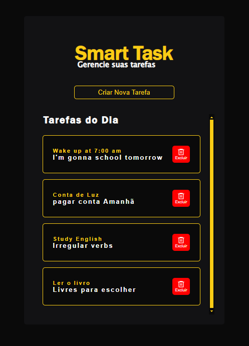
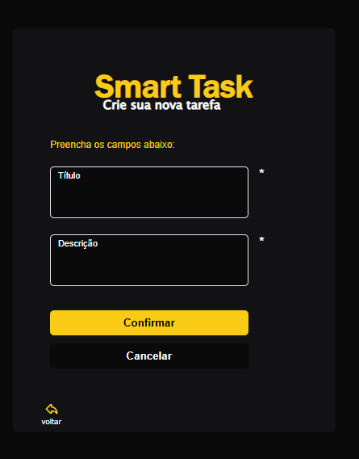

# React + TypeScript + Vite

Gerenciador de Tarefas

### Stacks usadas:

- Axios
- React Hook Form
- React Router
- Styled-Components
- Vite

## Tela de listagem de tarefas

## Tela para Criar tarefas

